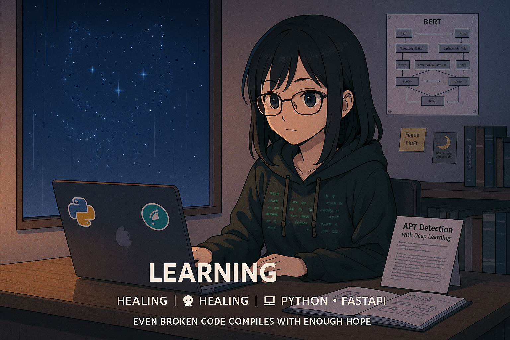

<!-- 👨‍💻 -->

<!-- Welcome to my GitHub profile! I'm a Python-powered **Web Developer** exploring the boundaries of backend, AI, and automation. Here you'll find personal projects, research ideas, experiments — and a few anime-inspired tech creations that reflect how I learn and build. -->

**Hello and welcome to my GitHub profile!**

I'm a *Web Developer* with a strong foundation in *Python*, passionate about building powerful backend systems and pushing the limits of what's possible with AI, automation, and creative coding. This space is a reflection of my learning journey — a mix of personal projects, research-driven ideas, and experimental code. You'll also notice a touch of my personality in the form of anime-inspired tech creations, blending art and logic in fun, unconventional ways. Whether you're here to collaborate, browse, or just curious, I hope you'll find something interesting in my work!

---

### 🔧 Tech Toolbox

- **Languages:** Python, JavaScript, SQL  
- **Frameworks:** Django, Flask, FastAPI  
- **Databases:** PostgreSQL, SQLite  
- **Skills:** REST APIs, Web Scraping, Bot Development, Docker (Learning)

---

### 📦 Featured Projects

**🔍 APT Detection System**

LSTM + CNN hybrid model for detecting stealthy cyber threats. Tackles challenges like imbalanced data and long-term dependencies.

**📤 Python Web Scrapers**

A toolbox of CLI/utility-based scrapers for collecting structured data from various sites.

**🌐 Dynamic Web Apps**

Full-stack backend APIs using Django REST Framework, Flask microservices, and lightweight UI components.

---

### 📚 Learning Focus

- 🦝 Master AI-powered decision systems in cybersecurity  
- 🧠 Use Docker & NGINX to containerize and deploy backend APIs  
- 🌱 learning 日本語
- 🌻 Urban gardening

---

### 🌐 Social & Platforms

- Codeforces – [@RakinSP](https://codeforces.com/profile/rakinsp)  
- Codeberg – [@lumii235](https://codeberg.org/lumii235)  
- Stack Overflow – [@lony235](https://stackoverflow.com/users/16396049/lony235?tab=profile)  
- Bluesky – [@lonelyh3b.bsky.social](https://bsky.app/profile/lonelyh3b.bsky.social)  
<!-- - LeetCode – [rakin54](https://leetcode.com/rakin54/) -->

<!-- - Kaggle – Coming soon -->

---

### 🤝 Let’s Collaborate

<!-- Whether you're building tools, researching security, or just want to nerd out over anime-themed bots — I’m always up for conversations and collabs. -->

<!-- I'm creating mascot-driven developer tools — bots and apps with anime-style personalities.
Many mascots were initially prototyped with AI, but I'd love to bring them to life with real collaborators! -->

🧩 Looking for projects to contribute:

  -  💻 Backend development

  -  ✍️ Writing tech blogs and articles

<!-- [Projects Include](projects.md) -->

📩 You can reach me:
- via [Discord](https://discord.com/users/rakin235)
- or open an [issue on GitHub](https://github.com/rakinplaban/rakinplaban/issues) if you'd like to team up!

---

### 💫 GitHub Stats

*This anime art rotates every 15 minutes — a surprise each time you visit 🌸.*

<!-- GitHub Stats Temporarily Hidden  

-->

### 🔝 Top Contributed Repos

---

## 👀 Profile View Counter

