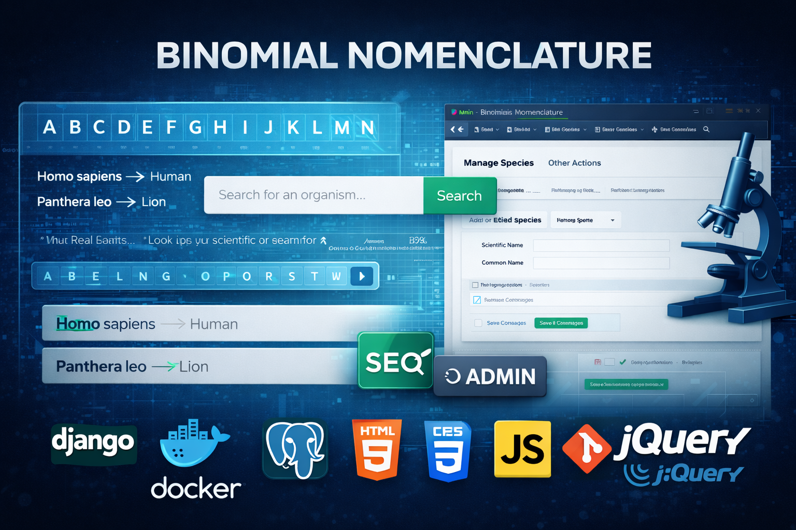

<!--  -->

<!-- 👨‍💻 -->

<!-- Welcome to my GitHub profile! I'm a Python-powered **Web Developer** exploring the boundaries of backend, AI, and automation. Here you'll find personal projects, research ideas, experiments — and a few anime-inspired tech creations that reflect how I learn and build. -->

**Hello and welcome to my GitHub profile!**

[Codeforces](https://codeforces.com/profile/rakinsp)  -- [Stack Overflow](https://stackoverflow.com/users/16396049/lony235?tab=profile) -- [Discord](https://discord.com/users/rakin235)  --  [Substack](https://substack.com/@1234176912/notes)  --  [Bluesky](https://bsky.app/profile/lonelyh3b.bsky.social)

I'm a *Web Developer* with a strong foundation in *Python*, passionate about building powerful backend systems and pushing the limits of what's possible with AI, automation, and creative coding. This space is a reflection of my learning journey — a mix of personal projects, research-driven ideas, and experimental code. You'll also notice a touch of my personality in the form of anime-inspired tech creations, blending art and logic in fun, unconventional ways. Whether you're here to collaborate, browse, or just curious, I hope you'll find something interesting in my work!

---
<!--  -->

### 🔧 Tech Toolbox

- **Languages:** Python, JavaScript, SQL  
- **Frameworks:** Django, Flask, FastAPI  
- **Databases:** PostgreSQL, SQLite  
- **Skills:** REST APIs, Web Scraping, Bot Development, Docker (Learning)

---

### 📦 Featured Projects

| Project | Illustrative Preview |
|--------|---------|
| **APT Detection using Deep Learning**   Cybersecurity research project focused on detecting Advanced Persistent Threats (APT) using deep learning models. Includes data preprocessing, feature engineering, and model evaluation.    **Tech:** Python, Pandas, PyTorch |  |
|**Discord Bot for AI News Scrapper**   Discord bot that blends research news from Hugging Face, arXiv, and MarkTechPost. It keeps the server up to date with the latest in AI and tech — a smart and social sidekick for your community.    **Tech:** Python, Flask, discord.py, Docker, PostgreSQL   Repo: https://github.com/lonelyH3b/Discord_AI_News_Bot||
|**Github Bot for Thanksgiving to Issue Creator** LumaBot is a GitHub bot built with FastAPI and gidgethub that interacts with issue creators by thanking them and reacting with a love emoji. It is designed to enhance community engagement while maintaining a simple and efficient workflow.   **Tech:** Python, FastAPI, Webhook, JWT, HTML/CSS  Repo:https://github.com/lonelyH3b/Github_Issue_Assistant_Bot||
|**Binomial Nomenclature**   A dictionary for looking up scientific names and the real names of plants and animals. A Django-based web application that allows users to easily look up organisms by their scientific (binomial) or common names. Features include SEO-friendly search, alphabetical browsing, a manual search bar, and a custom admin panel for managing species. This platform demonstrates full-stack web development with dynamic, user-friendly functionality.    **Tech:**HTML, CSS, JavaScript, jQuery, AJAX, PostgreSQL, Docker, and Git||
| **Social Networking Web App**    This project is a feature-rich, Twitter-inspired social networking application, developed for educational and learning purposes. It serves as a practical demonstration of how to build a modern, interactive platform with functionalities commonly found in social media.     **Tech:** Django, PostgreSQL, Docker, HTML/CSS |  |
| **Django Dynamic Web App**    Converted a static Django application into a fully database-driven system with dynamic content rendering and admin integration.     **Tech:** Django, SQLite, HTML/CSS |  |
| **Data Cleaning & Analysis Toolkit**    Python scripts for handling corrupted datasets, missing values, and large CSV files, with exploratory data analysis support.     **Tech:** Python, Pandas, NumPy |  |

<!---

### 📚 Learning Focus

- 🦝 Master AI-powered decision systems in cybersecurity  
- 🧠 Use Docker & NGINX to containerize and deploy backend APIs  
- 🌱 learning 日本語
- 🌻 Urban gardening

--->

<!--  -->
<!--
### 🌐 Social & Platforms

- Codeberg – [@lumii235](https://codeberg.org/lumii235)   -->

<!-- - LeetCode – [rakin54](https://leetcode.com/rakin54/) -->

<!-- - Kaggle – Coming soon -->

<!---

### 🤝 Let’s Collaborate

<!-- Whether you're building tools, researching security, or just want to nerd out over anime-themed bots — I’m always up for conversations and collabs. -->

<!-- I'm creating mascot-driven developer tools — bots and apps with anime-style personalities.
Many mascots were initially prototyped with AI, but I'd love to bring them to life with real collaborators! -->

<!--  

🧩 Looking for projects to contribute:

  -  💻 Backend development

  -  ✍️ Writing tech blogs and articles

<!-- [Projects Include](projects.md) 

📩 You can reach me:
- via 
- or open an [issue on GitHub](https://github.com/rakinplaban/rakinplaban/issues) if you'd like to team up!

--->
---
### 💫 GitHub Stats

*This anime art rotates every 15 minutes — a surprise each time you visit 🌸.*

<!-- GitHub Stats Temporarily Hidden  

-->

### 🔝 Top Contributed Repos

---

## 👀 Profile View Counter

